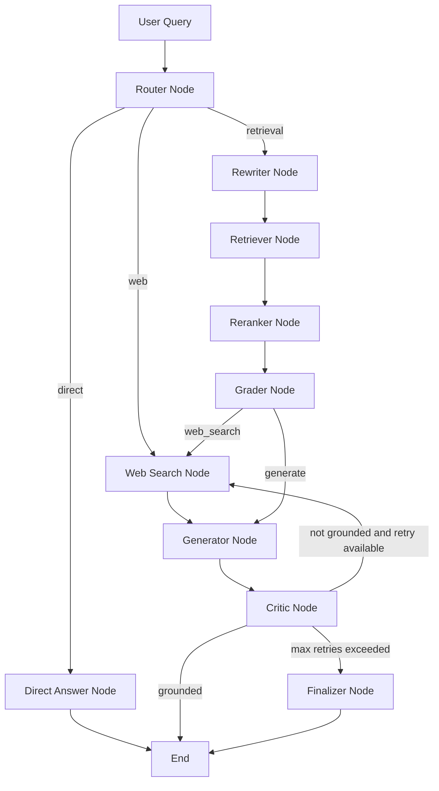

# AdaptiveRAG Agent

AdaptiveRAG Agent is a production-style Retrieval-Augmented Generation system that dynamically chooses between direct answering, document-grounded retrieval, and web search. It combines hybrid retrieval, reranking, query rewriting, HyDE, CRAG-style grading, adaptive routing, Self-RAG-style answer criticism, LangGraph orchestration, Tavily web search, and LangSmith observability/evaluation.

The project is built as a modular AI backend system using Python, LangChain, LangGraph, ChromaDB, Gemini, Hugging Face models, Tavily, and LangSmith.

---

## Problem Statement

Traditional RAG systems usually follow a fixed pipeline:

```text
user query -> retrieve documents -> pass context to LLM -> generate answer

```

This design has several limitations:

- It performs retrieval even for simple conceptual questions that do not need documents.
- It may generate an answer from weak or irrelevant retrieved chunks.
- It cannot answer current or external questions if the answer is not present in the indexed documents.
- It may produce unsupported answers if the final response is not checked against the context.
- It is hard to observe, evaluate, and debug without proper tracing and evaluation.

AdaptiveRAG Agent solves these issues by making the pipeline adaptive. It routes each query to the right path, checks retrieval quality before generation, uses web search when document context is insufficient, and critiques the final answer for grounding.

---

## Key Capabilities

- **Adaptive query routing**
  - Routes queries into:
    - `direct`
    - `retrieval`
    - `web`

- **Direct answering**
  - Answers simple conceptual questions without retrieval.

- **Hybrid retrieval**
  - Combines semantic vector search and BM25 keyword search.

- **Reciprocal Rank Fusion**
  - Merges semantic and keyword results into a single ranked list.

- **Cross-encoder reranking**
  - Reranks retrieved chunks using a local reranker model.

- **Query intelligence**
  - Query rewriting
  - Multi-query generation
  - HyDE-based semantic retrieval

- **CRAG-style grading**
  - Grades retrieved chunks as:
    - `relevant`
    - `ambiguous`
    - `irrelevant`

- **Web fallback**
  - Uses Tavily search when the graph needs external/current information or when document context is insufficient.

- **Self-RAG-style critic**
  - Checks whether the generated answer is grounded in the provided context.
  - Retries with web search if the answer is not grounded.
  - Uses a finalizer node to avoid returning unsupported answers after retry limit.

- **LangGraph orchestration**
  - Models the full workflow as a graph of nodes and conditional edges.

- **LangSmith observability and evaluation**
  - Adds tracing metadata and tags.
  - Runs evaluation on curated dataset examples.

- **Production polish**
  - Logging to terminal and `logs/adaptive_rag.log`
  - Graceful fallbacks
  - Type hints
  - Docstrings
  - Ruff linting and formatting
  - Centralized LLM and embedding client caching


---

## Architecture



---

## Pipeline Flow

### 1. Router

The router decides the query path:

```text
direct    -> answer directly
retrieval -> use document RAG pipeline
web       -> use Tavily web search

```

Example:

```text
"What is an embedding?"
-> direct

"What optimization techniques are proposed in the thesis?"
-> retrieval

"What are the latest developments in HBM memory in 2026?"
-> web

```

---

### 2. Retrieval Pipeline

For document-grounded questions, the system runs:

```text
rewriter_node
     |
retriever_node
     |
reranker_node
     |
grader_node

```

The retriever combines:

* rewritten query
* multi-query variants
* hybrid search
* HyDE semantic retrieval
* deduplication

---

### 3. Hybrid Search

Hybrid search uses:

```text
semantic_retrieval + BM25 keyword_search

```

Then fuses both result lists using Reciprocal Rank Fusion.

```text
semantic results
      |
RRF fusion -> fused ranked chunks
      ^
keyword results

```

---

### 4. Reranking

Retrieved candidates are passed to a cross-encoder reranker.

If reranking fails, the system falls back to the original retrieved chunks.

```text
reranker works
  |-> return reranked chunks

reranker fails
  |-> log exception
  |-> return original top chunks

```

---

### 5. CRAG Grading

The grader checks whether reranked chunks are good enough for answer generation.

Possible grades:

```text
relevant
ambiguous
irrelevant

```

Routing logic:

```text
all relevant -> generator
ambiguous / irrelevant -> web_search

```

---

### 6. Web Search

Web search is powered by Tavily.

If web search fails, the system logs the error and returns empty web results instead of crashing.

```text
Tavily works
  |-> return normalized web results

Tavily fails
  |-> return []

```

---

### 7. Generator

The generator builds final context from:

```text
reranked document chunks + optional web results

```

Then it generates a grounded answer.

If answer generation fails, the system returns a safe fallback message.

---

### 8. Critic and Finalizer

The critic checks whether the final answer is grounded in the provided context.

```text
grounded
  |-> finish

not_grounded and retry available
  |-> web_search -> generator -> critic

not_grounded after max retry
  |-> finalizer_node

```

The finalizer avoids returning unsupported answers.

---

## Tech Stack

| Category | Tool |
| --- | --- |
| Language | Python |
| RAG Framework | LangChain |
| Graph Orchestration | LangGraph |
| Vector Database | ChromaDB |
| Semantic Embeddings | Google Gemini Embeddings / Hugging Face Embeddings |
| Chat LLM | Gemini / Hugging Face configurable provider |
| Reranking | SentenceTransformers CrossEncoder |
| Keyword Search | BM25 |
| Web Search | Tavily |
| Observability | LangSmith |
| Evaluation | LangSmith Evaluation |
| Linting / Formatting | Ruff |
| PDF Loading | PyPDFLoader |

---

## Project Structure

```text
adaptive-rag/
├── data/
│   ├── documents/
│   └── chroma/
├── logs/
│   └── adaptive_rag.log
├── src/
│   ├── __init__.py
│   ├── client.py
│   ├── config.py
│   ├── graph.py
│   ├── prompts.py
│   ├── state.py
│   ├── tools.py
│   ├── ingestion/
│   │   ├── __init__.py
│   │   ├── embedder.py
│   │   ├── loader.py
│   │   └── vectorstore.py
│   ├── retrieval/
│   │   ├── __init__.py
│   │   ├── hybrid.py
│   │   ├── keyword.py
│   │   ├── reranker.py
│   │   └── semantic.py
│   ├── nodes/
│   │   ├── __init__.py
│   │   ├── critic.py
│   │   ├── direct_answer.py
│   │   ├── generator.py
│   │   ├── grader.py
│   │   ├── reranker.py
│   │   ├── retriever.py
│   │   ├── rewriter.py
│   │   ├── router.py
│   │   └── web_search.py
│   ├── evaluation/
│   │   ├── __init__.py
│   │   ├── dataset.py
│   │   ├── evaluators.py
│   │   └── run_eval.py
│   └── utils/
│       ├── __init__.py
│       └── documents.py
├── tests/
├── ingest.py
├── main.py
├── main_stage1.py
├── main_stage2.py
├── main_stage4.py
├── main_stage5.py
├── pyproject.toml
├── .env.example
└── README.md

```

---

## Environment Variables

Create a `.env` file in the project root.

Example:

```env
HUGGINGFACEHUB_API_TOKEN=your_huggingface_token_here
LANGSMITH_API_KEY=your_langsmith_key_here
LANGSMITH_TRACING=true
LANGSMITH_PROJECT=adaptive-rag

TAVILY_API_KEY=your_tavily_key_here
GOOGLE_API_KEY=your_google_key_here

LLM_PROVIDER=google
LLM_MODEL=Qwen/Qwen2.5-72B-Instruct
GOOGLE_LLM_MODEL=gemini-2.5-flash

EMBEDDING_PROVIDER=google
EMBEDDING_MODEL=BAAI/bge-base-en-v1.5
GOOGLE_EMBEDDING_MODEL=gemini-embedding-001

RERANKER_MODEL=BAAI/bge-reranker-base

```

---

## Installation

### 1. Clone the repository

```bash
git clone <your-repo-url>
cd adaptive-rag

```

### 2. Create virtual environment

```bash
python -m venv .venv

```

Activate it:

```bash
.venv\Scripts\activate

```

For Linux/macOS:

```bash
source .venv/bin/activate

```

### 3. Install dependencies

```bash
pip install -e .

```

If Ruff is not installed:

```bash
pip install ruff

```

---

## Ingest Documents

Place your PDF inside:

```text
data/documents/

```

Then run:

```bash
python ingest.py --file data/documents/MTP_Report.pdf

```

This will:

1. Load PDF pages
2. Split the document into chunks
3. Normalize metadata
4. Generate embeddings
5. Store chunks in ChromaDB

---

## Run the Application

```bash
python main.py

```

With debug output:

```bash
python main.py --debug

```

Example:

```text
Question: What optimization techniques are proposed in the thesis?

```

To exit:

```text
exit

```

## Run Evaluation

Run LangSmith evaluation:

```bash
python -m src.evaluation.run_eval

```

The evaluation pipeline uses:

* curated dataset examples from the thesis
* correctness evaluator
* faithfulness evaluator
* LangSmith experiment tracking

---

## Logging

Logs are written to:

```text
logs/adaptive_rag.log

```

Logs are also printed to the terminal.

The logging format is:

```text
timestamp | module_name | log_level | message

```

Example:

```text
2026-07-02 19:05:20 | src.nodes.router | INFO | Router selected route: direct

```

The project uses module-level loggers:

```python
logger = logging.getLogger(__name__)

```

This makes it clear which file produced each log.

---

## Error Handling and Graceful Degradation

The project includes production-style fallback behavior.

| Component | Failure | Fallback |
| --- | --- | --- |
| Reranker | CrossEncoder load/predict fails | Use original retrieved chunks |
| Tavily Web Search | API/network failure | Return empty web results |
| Generator | LLM generation fails | Return safe fallback answer |
| Router | LLM routing fails | Default to retrieval |
| Rewriter | Query rewrite fails | Use original query |
| Multi-query | Multi-query generation fails | Continue without variants |
| HyDE | HyDE generation fails | Use original query |
| Semantic Retrieval | Chroma retrieval fails | Return empty result list |
| Keyword Search | BM25 build/search fails | Return empty result list |
| Hybrid Fusion | RRF merge fails | Use semantic or keyword results |
| Critic | Grounding check fails | Mark answer as not grounded |
| Ingestion | PDF/vectorstore/embedding failure | Log and raise error |

---

## Evaluation Dataset

The evaluation dataset includes thesis-grounded questions such as:

```text
What is the title of the thesis report?
Who submitted the thesis and under whose guidance was it completed?
What are the two memory placement methods proposed in the thesis?
What is Dynamic Migration?
What simulation tools were used in the thesis?
Which benchmarks were used in the thesis evaluation?
What metrics were used to evaluate the proposed methods?
What were the main results of Dynamic Migration?

```

It also includes route-specific questions:

```text
What is an embedding?
What are the latest developments in HBM memory in 2026?

```

---

## Demo Questions

Use these questions to demonstrate different capabilities.

### 1. Direct Answer Route

```text
What is an embedding?

```

Expected behavior:

```text
router -> direct_answer -> END

```

---

### 2. Retrieval Route

```text
What optimization techniques are proposed in the thesis?

```

Expected behavior:

```text
router -> rewriter -> retriever -> reranker -> grader -> generator -> critic

```

---

### 3. Web Route

```text
What are the latest developments in HBM memory in 2026?

```

Expected behavior:

```text
router -> web_search -> generator -> critic

```

---

### 4. Citation Demonstration

```text
What simulation tools were used in the thesis?

```

Expected behavior:

```text
answer includes document-grounded context and citations

```

---

### 5. Methodology Understanding

```text
How does Dynamic Migration decide whether to migrate a page?

```

Expected behavior:

```text
retrieval route with methodology-specific chunks

```

---

## Development Stages

### Stage 0 – Project Setup

* Created project structure
* Configured environment variables
* Added dependency management
* Set up ChromaDB persistence

### Stage 1 – Naive RAG

* Loaded documents
* Split documents into chunks
* Embedded chunks
* Stored chunks in ChromaDB
* Retrieved relevant chunks
* Generated answers from retrieved context

### Stage 2 – Hybrid Search + Reranking

* Added BM25 keyword search
* Added semantic search
* Combined results using Reciprocal Rank Fusion
* Added cross-encoder reranking

### Stage 3 – Query Intelligence

* Added query rewriting
* Added multi-query generation
* Added HyDE retrieval

### Stage 4 – LangGraph + CRAG

* Converted pipeline into LangGraph workflow
* Added graph state
* Added CRAG-style chunk grading
* Added conditional web fallback

### Stage 5 – Adaptive Router + Self-RAG Critic

* Added router node
* Added direct answer path
* Added Self-RAG-style critic
* Added retry path and safe finalizer

### Stage 6 – LangSmith Observability + Evaluation

* Added tracing metadata and tags
* Created curated evaluation dataset
* Added correctness evaluator
* Added faithfulness evaluator
* Connected evaluation pipeline to LangSmith

### Stage 7 – Production Polish

* Added logging
* Added graceful error handling
* Centralized LLM and embedding client caching
* Cleaned docstrings
* Ran Ruff linting and formatting
* Prepared README and demo plan

---

## Code Quality

Run Ruff checks:

```bash
ruff check .

```

Auto-fix lint issues:

```bash
ruff check . --fix

```

Format code:

```bash
ruff format .

```

Compile check:

```bash
python -m compileall src

```

---

## Future Improvements

Potential next improvements:

* Add FastAPI service layer for REST API access.
* Add Dockerfile and docker-compose setup.
* Add streaming responses.
* Add UI using Streamlit or React.
* Add query-level caching.
* Add evaluation dashboards.
* Add batched chunk grading to reduce latency.
* Add smarter retry query rewriting for Self-RAG.
* Add role-based configuration for local, dev, and production environments.
* Add unit tests and integration tests.
* Add CI pipeline with Ruff and evaluation smoke tests.

---

## Current Status

AdaptiveRAG Agent currently supports:

```text
direct answering
document-grounded retrieval
hybrid search
reranking
query rewriting
multi-query retrieval
HyDE retrieval
CRAG-style grading
web fallback
Self-RAG-style criticism
safe finalization
LangSmith tracing
LangSmith evaluation
production logging
graceful fallbacks


```

```

```